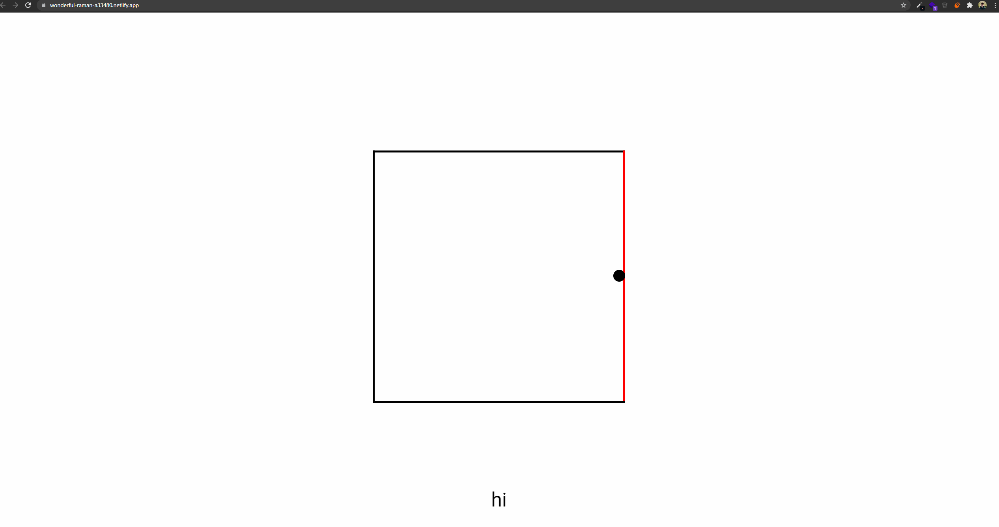

# Interactive-Surface

Tasked with creating an interactive experience during the middle of the first lockdown. I found myself struggling to create ideas for the experience and so I chose to centre my experience around the lockdown I was in myself. I wanted to emote my feelings through the journey that the user partook in. This was feelings of being trapped, lost, distant, repetition and hopelessness.

### Screen capture

To experience this journey [click here](https://wonderful-raman-a33480.netlify.app/)
